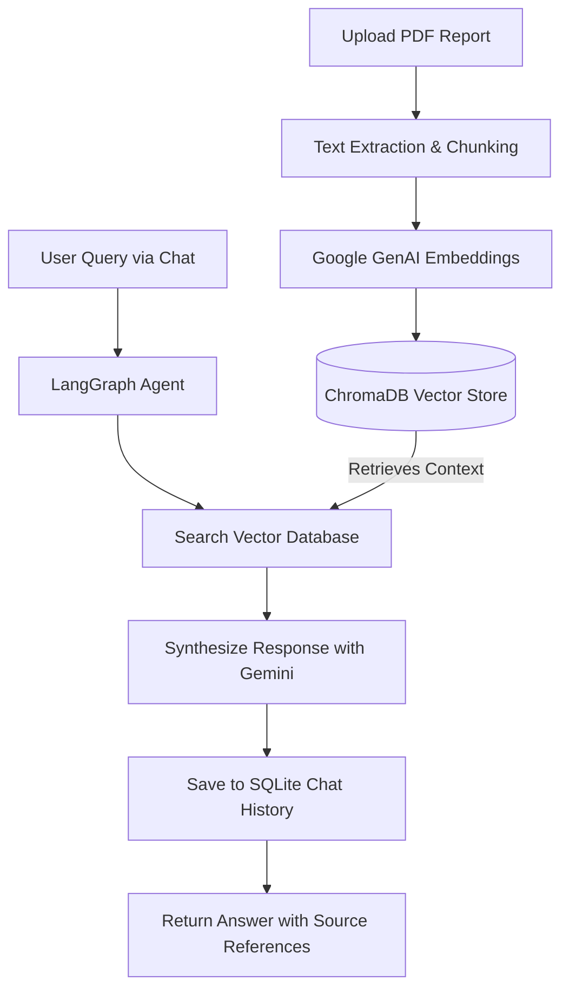

# AI Business Analyst: RAG-Powered BI Assistant

A comprehensive, state-of-the-art Business Intelligence (BI) platform powered by Retrieval-Augmented Generation (RAG). The system features an interactive real-time dashboard, granular analytics visualization, a document processing library, and an AI chat assistant powered by **FastAPI**, **LangGraph**, **ChromaDB**, and **Google Gemini** (LangChain).

---

## 🚀 Key Features

*   📊 **Executive BI Dashboard**: Real-time business metrics tracking (Revenue, Transactions, Churn, and Retention Goals) with dynamic visual representations using Recharts.
*   🤖 **AI Analyst Chat**: A conversational agent powered by LangGraph that maintains context, remembers session history, and answers complex questions using uploaded business reports.
*   📂 **Document Management Pipeline**: Upload, parse, and index PDF reports into a vector database (ChromaDB) in the background.
*   📈 **Granular Analytics**: Dynamic regional financial analyses, customer satisfaction (CSAT) ratings, and product segment revenue shares.
*   🧪 **Evaluation Framework**: An automated test suite evaluating RAG accuracy, factual overlap, and source attribution.

---

## 🛠️ Tech Stack

### Backend
*   **FastAPI**: High-performance API server.
*   **LangGraph & LangChain**: Orchestration of the conversational agent and agentic workflows.
*   **Google Gemini API**: Advanced LLM for reasoning and text generation.
*   **ChromaDB**: Lightweight vector database for indexing and semantic document retrieval.
*   **SQLite**: Local database for chat history and document indexing metadata.

### Frontend
*   **React (Vite)**: Modern, lightning-fast frontend development runtime.
*   **Tailwind CSS**: Sleek, glassmorphism-inspired dark mode styling.
*   **Recharts**: Interactive data visualization charts.
*   **Lucide Icons**: Premium iconography.

---

## 📁 Repository Structure

```text
├── backend/
│   ├── app/
│   │   ├── config.py           # Application configurations and env variables loader
│   │   ├── main.py             # FastAPI entrypoint and controllers
│   │   ├── rag/
│   │   │   ├── graph.py        # LangGraph workflow definition for agentic chat
│   │   │   └── pipeline.py     # PDF chunking, embedding, indexing pipeline
│   │   └── services/
│   │       └── db.py           # SQLite db manager (history & doc metadata)
│   ├── scripts/
│   │   └── generate_reports.py # Helper script to create synthetic reports
│   ├── requirements.txt        # Python dependency manifest
│   └── venv/                   # Local python virtual environment
├── frontend/
│   ├── src/
│   │   ├── pages/              # Dashboard, Chat, Analytics, and Reports pages
│   │   ├── services/
│   │   │   └── api.js          # API service layer wrapping fetch requests
│   │   ├── App.jsx             # Main routing and navigation sidebar
│   │   └── main.jsx            # Application mount configuration
│   ├── vite.config.js          # Vite config with backend proxy mapping (/api -> port 8000)
│   └── package.json            # Node.js dependencies
└── evaluation/
    └── evaluate.py             # RAG validation script & evaluation dataset
```

---

## ⚙️ Setup & Installation

### Prerequisite: API Key Setup
Configure the environment variables by preparing a `.env` file in the `backend/` directory:
1. Copy `backend/.env.example` to `backend/.env`.
2. Add your **Google Gemini API Key**:
```env
GEMINI_API_KEY=your_gemini_api_key_here
PORT=8000
HOST=127.0.0.1
DB_PATH=./data/bi_analyst.db
VECTOR_DB_PATH=./data/vector_db
```

### 1. Running the Backend
Navigate to the `backend/` folder, activate the virtual environment, install dependencies, and run the server:

```powershell
# Navigate to backend
cd backend

# Activate Virtual Environment (PowerShell)
.\venv\Scripts\Activate.ps1

# Install Dependencies
pip install -r requirements.txt

# Run the FastAPI server
uvicorn app.main:app --reload
```
The backend API will run on `http://127.0.0.1:8000`. You can inspect the interactive OpenAPI documentation at `http://127.0.0.1:8000/docs`.

### 2. Running the Frontend
In a new terminal window, navigate to the `frontend/` folder, install the packages, and start the development server:

```powershell
# Navigate to frontend
cd frontend

# Install Node modules
npm install

# Run the development server
npm run dev
```
Open `http://localhost:5173` in your browser to view the application.

---

## 🤖 System Architecture & RAG Pipeline



---

## 🧪 Running Evaluations
To run automated tests against the RAG pipeline to verify its accuracy, run:

```powershell
cd evaluation
python evaluate.py
```
This script evaluates the pipeline against a synthetic dataset (`EVAL_DATASET`) measuring answer correctness, fact consistency, and source attribution metrics.
